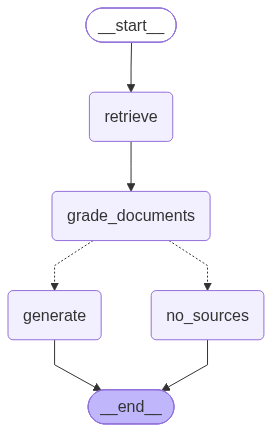
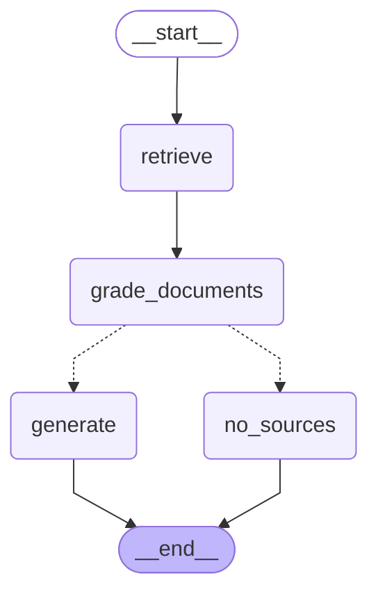

# Enterprise Multimodal RAG & Microservices Platform

[](#quick-start-with-docker-compose)
[](https://fastapi.tiangolo.com)
[](https://langchain-ai.github.io/langgraph/)
[](https://react.dev/)
[](https://www.mongodb.com/products/platform/atlas-vector-search)
[](https://www.cloudflare.com/products/r2/)

A production-ready, fully decoupled **Enterprise Multimodal Retrieval-Augmented Generation (RAG)** platform. Built to ingest, parse, vector-index, and semantically query complex heterogeneous corporate documents (PDF, DOCX, PPT, PPTX, XLSX) through an autonomous **LangGraph Self-Corrective StateGraph** with strict Pydantic structured output validation, interactive multi-turn memory, and high-resolution visual/tabular source attribution.

---

## Table of Contents
- [System Architecture Overview](#system-architecture-overview)
- [Chat Service Architecture & Graph](#chat-service-architecture--graph)
  - [Compiled LangGraph Workflow Image](#compiled-langgraph-workflow-image)
  - [Mermaid Flowchart](#mermaid-flowchart)
  - [Node-by-Node Explanation](#node-by-node-explanation)
  - [Strict Pydantic Structured Output](#strict-pydantic-structured-output)
- [Ingestion Service Architecture](#ingestion-service-architecture)
  - [Dual-Path Ingestion Pipeline](#dual-path-ingestion-pipeline)
  - [Path A: Visual Documents (PDF, DOCX, PPT, PPTX)](#path-a-visual-documents-pdf-docx-ppt-pptx)
  - [Path B: Tabular Spreadsheets (XLSX, XLS)](#path-b-tabular-spreadsheets-xlsx-xls)
  - [Cloudflare R2 Object Storage](#cloudflare-r2-object-storage)
  - [Live Stage Tracking & Directory Watcher](#live-stage-tracking--directory-watcher)
- [Technology Stack](#technology-stack)
- [Project Directory Structure](#project-directory-structure)
- [Configuration & Environment Variables](#configuration--environment-variables)
- [Quick Start with Docker Compose](#quick-start-with-docker-compose)
- [API Endpoints Reference](#api-endpoints-reference)

---

## System Architecture Overview

The system is engineered as a **loosely coupled microservices architecture** where independent services communicate exclusively via MongoDB Atlas and standard REST APIs:

```
                              +---------------------------------------+
                              |         React 19 + TypeScript         |
                              |          Frontend (Port 5173)         |
                              +-------------------+-------------------+
                                                  |
                      +---------------------------+---------------------------+
                      | HTTP (Live Polling / REST)                            | HTTP (REST)
                      v                                                       v
    +-----------------------------------+                   +-----------------------------------+
    |        Ingestion Service          |                   |           Chat Service            |
    |            (Port 8001)            |                   |            (Port 8000)            |
    | - Headless LibreOffice Conversion |                   | - LangGraph Agentic StateGraph    |
    | - PyMuPDF (150 DPI Page PNGs)     |                   | - MongoDB Atlas $vectorSearch     |
    | - Gemma-3-27b-it Vision Filter    |                   | - Semantic List-wise Re-ranking   |
    | - LlamaParse Markdown Extractor   |                   | - Strict Pydantic Output Schemas  |
    | - Recursive Chunking (800 / 150)  |                   | - Grounded Synthesis [1], [2]     |
    | - Excel Row Batching (Zero PNG)   |                   | - Multi-Turn Session Memory       |
    | - Cloudflare R2 Object Storage    |                   | - Direct Google GenAI Fallback    |
    +-----------------+-----------------+                   +-----------------+-----------------+
                      |                                                       |
                      +---------------------------+---------------------------+
                                                  |
                                                  v
                                    +---------------------------+
                                    |    MongoDB Atlas Cluster  |
                                    |  Database: multimodal_rag |
                                    |                           |
                                    | - vectors (768d Index)    |
                                    | - conversations           |
                                    | - ingestion_jobs          |
                                    +---------------------------+
```

---

## Chat Service Architecture & Graph

The `chat-service` is an autonomous conversational microservice orchestrating multi-turn retrieval and synthesis via a compiled **LangGraph `StateGraph`**.

### Compiled LangGraph Workflow Image

The following image represents the exact LangGraph runtime graph compiled via `graph.get_graph().draw_mermaid_png()`:



### Mermaid Flowchart



### Node-by-Node Explanation

| Node | Model / Tool | Latency | Purpose & Behavior |
| :--- | :--- | :--- | :--- |
| **`retrieve`** | `gemini-embedding-001` + Atlas `$vectorSearch` | ~150ms | Embeds the user question (768d, cached in-memory) and retrieves top 8 candidate chunks (`numCandidates=100`). |
| **`grade_documents`** | `google/gemini-2.5-flash-lite` (Structured Output) | ~200ms | **List-wise Re-ranker & Relevance Quality Gate**. Semantically re-orders candidates by answer usefulness, selects the top 1–3 most relevant passage IDs, and detects out-of-domain queries. |
| **`decide_after_grading`** | Conditional Edge Router | <1ms | Routes directly to `generate` if `documents_relevant == True`; routes to `no_sources` if `documents_relevant == False`. |
| **`generate`** | `google/gemini-2.5-flash-lite` (Structured Synthesis) | ~500ms | Synthesizes a factual, grounded answer citing sources inline (e.g. `[1]`, `[2]`). Guarantees that only cited passages are emitted to the UI as visual/tabular cards. |
| **`no_sources`** | `google/gemini-2.5-flash-lite` | ~150ms | Formulates a concise, polite notice explaining that no matching records were found in the knowledge base, returning zero image attachments. |

### Strict Pydantic Structured Output

Both the re-ranking and synthesis stages use explicit **Pydantic Schemas** via LangChain's `llm.with_structured_output(schema)` with secondary fallback to Google GenAI SDK's native `response_schema=schema`:

#### 1. Re-ranking Schema (`RerankOutput`)
```python
class RerankOutput(BaseModel):
    is_relevant: bool = Field(
        description="True if candidate passages answer question; False if completely out-of-domain."
    )
    ranked_ids: List[int] = Field(
        default_factory=list,
        description="Top 1 to 3 candidate passage IDs in descending order of relevance (e.g., [2, 1, 5])."
    )
    reasoning: Optional[str] = Field(
        default=None,
        description="Brief explanation of why passages were selected or rejected."
    )
```

#### 2. Answer Synthesis Schema (`SynthesisOutput`)
```python
class SynthesisOutput(BaseModel):
    answer: str = Field(
        description="Grounded, factual answer citing sources inline using bracketed format like [1], [2]."
    )
    cited_sources: List[int] = Field(
        default_factory=list,
        description="Exact list of citation ID numbers actually referenced in the answer (e.g., [1, 2])."
    )
```

---

## Ingestion Service Architecture

The `ingestion-service` processes incoming documents through two isolated, specialized ingestion tracks:

```
                            Incoming Document
                                   |
                  +----------------+----------------+
                  |                                 |
         [PDF, DOCX, PPT, PPTX]               [XLSX, XLS]
                  |                                 |
           (Visual Track)                    (Tabular Track)
                  v                                 v
          Headless LibreOffice               Pandas Multi-Sheet
             PDF Conversion                     Excel Parser
                  v                                 v
           PyMuPDF Rendering                 Token-Aware Batching
          150 DPI Page PNGs                   (5-20 Rows / Chunk)
                  v                                 v
        Gemma-3-27b-it Vision               Markdown Table Format
          Relevance Filter                  + Clean BSON Records
                  v                                 v
         LlamaParse Markdown                (Zero Screenshots)
              Extraction                            |
                  v                                 |
        Recursive Text Chunking                     |
        (800 chars, 150 overlap)                    |
                  v                                 |
        Cloudflare R2 Storage                       |
        (Zero-Egress Image CDN)                     |
                  |                                 |
                  +----------------+----------------+
                                   |
                                   v
                        gemini-embedding-001
                       (768d Vector Embeddings)
                                   v
                         MongoDB Atlas Vector
                          Search Collection
```

### Path A: Visual Documents (PDF, DOCX, PPT, PPTX)
1. **Headless LibreOffice Conversion**: Converts DOCX, PPT, and PPTX to PDF using isolated profile directories (`-env:UserInstallation`) to prevent concurrency locks, with native `python-pptx` fallback.
2. **Page Screenshot Rendering**: `PyMuPDF` (`fitz`) renders 150 DPI PNG page screenshots.
3. **Vision Relevance Filter**: `google/gemma-3-27b-it` classifies page images to filter out blank, cover, or decorative pages.
4. **LlamaParse Extraction**: Cloud-powered layout-aware markdown extraction for tables, columns, and charts (with local OCR fallback).
5. **Recursive Chunking**: Splits extracted text into semantic chunks up to **800 characters with 150 character overlap**, preserving paragraph and sentence boundaries.
6. **Cloudflare R2 Upload**: Uploads screenshot assets and converted PDFs to Cloudflare R2 bucket with automated fallback to local `/static` URLs.

### Path B: Tabular Spreadsheets (XLSX, XLS)
1. **Multi-Sheet Parsing**: Iterates through every sheet in the workbook using `pandas`.
2. **Dynamic Row Batching**: Calculates token load dynamically based on column count, grouping rows into 5–20 row batches to prevent embedding truncation.
3. **BSON & Markdown Sanitization**: Strips `NaN`, `inf`, and raw timestamps, generating clean markdown tables and structured BSON arrays.
4. **Zero-Screenshot Policy**: Enforces lightweight, high-density structured tabular indexing without generating wasteful images.

### Cloudflare R2 Object Storage
* **Zero Egress Fees**: Cloudflare R2 S3-compatible cloud storage serves high-resolution page screenshots to the frontend.
* **Resilient Fallback**: If R2 credentials are not provided or network is offline, screenshots automatically fallback to local static file serving (`/static/images/...`).

### Live Stage Tracking & Directory Watcher
* **Thread-safe Job Manager**: Real-time progress updates (`0%` to `100%`) synchronized live with MongoDB Atlas (`ingestion_jobs` collection).
* **Background Directory Watcher**: Automatically monitors `data_drop/`, verifies write completion, and triggers ingestion without manual intervention.

---

## Technology Stack

| Layer | Component | Description / Details |
| :--- | :--- | :--- |
| **Agent Framework** | `LangGraph` & `LangChain Core` | Compiled `StateGraph` state machine for self-corrective retrieval. |
| **Language Models** | `google/gemma-3-27b-it` & `google/gemini-2.5-flash-lite` | OpenRouter low-latency utility & generation models with Google GenAI fallback. |
| **Embedding Model** | `gemini-embedding-001` | 768-dimensional dense vector embeddings with batching and exponential backoff. |
| **Vector Database** | `MongoDB Atlas` | 768d cosine similarity `$vectorSearch` index, chat memory, and job storage. |
| **Object Storage** | `Cloudflare R2` (S3 API) | High-speed, zero-egress object storage for document screenshots and PDFs. |
| **Document Parsing** | `PyMuPDF`, `LibreOffice`, `python-pptx`, `LlamaParse`, `pandas` | Heterogeneous multi-format document conversion and layout extraction. |
| **Backend Framework** | `FastAPI` + `Uvicorn` | High-performance asynchronous microservices with lifespan management. |
| **Frontend Framework** | `React 19` + `TypeScript` + `Vite` | Dark-themed UI with pan/zoom screenshot modal, tabular data card, and stage stepper. |

---

## Project Directory Structure

```
assignment3/
├── assets/
│   └── chat_graph.png                 # LangGraph compiled architecture diagram
├── chat-service/
│   ├── Dockerfile                     # Python 3.11 microservice container
│   ├── requirements.txt               # Dependencies (langgraph, langchain, motor, google-genai)
│   └── src/
│       ├── main.py                    # FastAPI application & lifespan
│       ├── agent/
│       │   ├── graph.py               # LangGraph StateGraph builder & compiler
│       │   ├── nodes.py               # Nodes: retrieve, grade_documents, generate, no_sources
│       │   ├── llm.py                 # Structured output callers & GenAI fallback
│       │   ├── state.py               # AgentState TypedDict schema
│       │   └── tools.py               # Atlas 768d vector search retriever
│       ├── db/
│       │   ├── connection.py          # MongoDB & GenAI clients
│       │   └── memory.py              # Multi-turn conversational memory
│       ├── models/
│       │   └── schemas.py             # RerankOutput, SynthesisOutput, ChatRequest/Response
│       └── routes/
│           └── chat_routes.py         # /chat, /documents, /health endpoints
├── ingestion-services/
│   ├── Dockerfile                     # Debian Python 3.11 with LibreOffice & PyMuPDF
│   ├── requirements.txt               # Dependencies (pymupdf, llama-parse, pandas, boto3)
│   └── src/
│       ├── main.py                    # FastAPI entrypoint & background watcher thread
│       ├── core/config.py             # Environment configurations
│       ├── models/schemas.py          # JobStatus, JobStage, UploadResponse, HealthResponse
│       ├── services/
│       │   ├── job_manager.py         # Thread-safe job tracker with Atlas sync
│       │   ├── pipeline_orchestrator.py # Concurrent visual & tabular pipeline runner
│       │   └── watcher.py             # Automated data_drop/ directory watcher
│       ├── pipelines/
│       │   ├── chunking.py            # Recursive character chunker (800 / 150)
│       │   ├── converter.py           # Headless LibreOffice & python-pptx fallback
│       │   ├── excel_pipeline.py      # Multi-sheet row batcher (zero screenshots)
│       │   ├── llama_parser.py        # Cloud markdown extraction
│       │   ├── vision_filter.py       # Gemma-3-27b-it vision classification
│       │   └── visual_pipeline.py     # 150 DPI page screenshot renderer
│       ├── storage/
│       │   ├── r2_storage.py          # Cloudflare R2 S3 storage manager
│       │   └── vector_store.py        # Batch embedding generator & Atlas ingester
│       └── routes/
│           └── ingestion_routes.py    # /upload, /jobs/{id}, /documents, /health
├── frontend/
│   ├── Dockerfile                     # Multi-stage Node.js build + Nginx Alpine
│   ├── src/
│   │   ├── App.tsx                    # Chat workspace & modal coordinator
│   │   ├── components/
│   │   │   ├── MessageBubble.tsx      # Markdown parser with inline citation tags
│   │   │   ├── VisualModal.tsx        # High-res pan-and-zoom page inspector
│   │   │   ├── ExcelDataCard.tsx      # Tabular interactive data viewer
│   │   │   └── IngestionModal.tsx     # Real-time multi-stage upload progress stepper
│   │   └── types.ts                   # Unified TypeScript API interfaces
├── data_drop/                         # Directory watched for automatic file ingestion
├── processed_output/                  # Local storage for converted PDFs and screenshots
├── docker-compose.yml                 # Multi-container orchestration specification
├── .env.example                       # Reference environment variables
└── README.md                          # Project documentation
```

---

## Configuration & Environment Variables

Copy `.env.example` to `.env` in the root directory:

```bash
cp .env.example .env
```

| Key | Required | Description |
| :--- | :---: | :--- |
| `MONGO_URI` | **Yes** | MongoDB Atlas connection URI (`mongodb+srv://...`). |
| `MONGO_DB` | **Yes** | Database name (e.g., `multimodal_rag`). |
| `GEMINI_API_KEY` | **Yes** | Google Gemini API key for embeddings and fallback LLM. |
| `OPENROUTER_API_KEY` | Optional | OpenRouter key for `gemma-3-27b-it` vision and `gemini-2.5-flash-lite`. |
| `LLAMA_CLOUD_API_KEY`| Optional | LlamaParse API key for complex document markdown parsing. |
| `R2_ACCOUNT_ID` | Optional | Cloudflare R2 Account ID. |
| `R2_ACCESS_KEY_ID` | Optional | Cloudflare R2 S3 Access Key. |
| `R2_SECRET_ACCESS_KEY`| Optional | Cloudflare R2 S3 Secret Key. |
| `R2_BUCKET_NAME` | Optional | Cloudflare R2 bucket name. |
| `R2_PUBLIC_URL` | Optional | Public CDN URL for Cloudflare R2 bucket (`https://pub-xxx.r2.dev`). |

---

## Quick Start with Docker Compose

Deploy the entire stack with a single command:

```bash
docker compose up -d --build
```

### Access URLs:
* **Frontend UI**: [http://localhost:5173](http://localhost:5173)
* **Chat Service API & Docs**: [http://localhost:8000/docs](http://localhost:8000/docs)
* **Ingestion Service API & Docs**: [http://localhost:8001/docs](http://localhost:8001/docs)

---

## API Endpoints Reference

### Chat Service (`http://localhost:8000`)
* `POST /chat`: Query the LangGraph RAG state machine with session ID and message.
* `GET /health`: Health status, database connectivity, and total vector count.
* `GET /documents`: Aggregated list of indexed documents and chunk statistics.

### Ingestion Service (`http://localhost:8001`)
* `POST /upload`: Upload document (`multipart/form-data`) and receive a tracked `job_id`.
* `GET /jobs/{job_id}`: Poll live status, current stage, and progress percentage (`0-100%`).
* `GET /jobs`: List recent ingestion jobs.
* `GET /documents`: Aggregated document repository statistics.
* `GET /health`: Ingestion service health and Cloudflare R2 configuration status.
